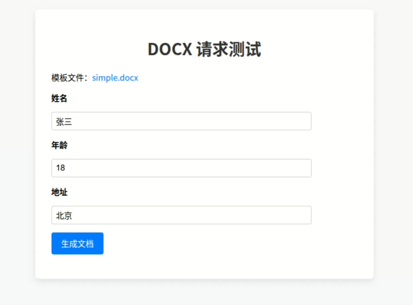

# docx-tmpl 提供一个.docx 文件生成服务

## 开发指南

1. 安装依赖

```bash
bun install
```

2. 运行

```bash
bun dev
```

## 编译打包

```bash
# 编译
bun run build:prod
# linux/arm64
bun run build:linux:arm64
# darwin/arm64
bun run build:darwin:arm64
```

编译成功后在 dist 目录下生成 `docx-templ` 文件

## 运行服务

```bash
./docx-tmpl
```

可以指定监听的端口号:

```bash
PORT=3001 ./docx-tmpl
```

## API

接口采用 UTF-8 编码，请求参数为 json 格式。

假设服务器监听地址: `http://localhost:8080`

### 1. 请求生成文档

- 请求路径: `/api/docx`
- 请求方式: `POST`
- 请求参数: `application/json`

| 参数名称     | 参数类型 | 是否必填 | 参数描述                                                         |
| :----------- | :------- | :------- | :--------------------------------------------------------------- |
| template_url | string   | 是       | 模板文件地址, 必须以 `http://` 或 `https://` 开头                |
| data         | object   | 是       | 文档数据, 必须是与模板变量匹配的 json 格式，参数以模板中使用为准 |
| output_file  | string   | 是       | 输出文件名，必须以 `.docx` 结尾                                  |
| template_token        | string   | 否       | 如果非空，服务请求模板文件时会通过请求头发送令牌,                                                                 |

- 请求示例:

```json
{
    "template_url": "{{HOST}}/files/sample.docx",
    "data": {
        "name": "John Doe",
        "age": 30,
        "address": " Main St"
    },
    "output_file": "output导出文件.docx",
    "template_token": "TOKEN"
}
```


- 成功返回: `application/vnd.openxmlformats-officedocument.wordprocessingml.document`

成功时返回文档附件, 可以按照附件下载，参考 [sample.html](public/sample.html)

- 失败返回: `application/json`

| 参数名称       | 类型   | 非空 | 说明                                         |
| :------------- | :----- | :--- | :------------------------------------------- |
| code           | int    | 是   | 错误码                                       |
| message        | string | 是   | 错误信息                                     |
| template_error | string | 否   | 获取模板时的错误信息, 由提供模板的服务器返回 |

示例:

  ```json
  {
    "code": 500,
    "message": "获取模板文件失败",
    "template_error": "{\"code\":400,\"message\":\"示例模板文件不正确\"}"
  }
  ```

### 2. 演示页

- 请求路径: `/example`

例如: `http://localhost:8080/example`




This project was created using `bun init` in bun v1.2.16. [Bun](https://bun.sh) is a fast all-in-one JavaScript runtime.
